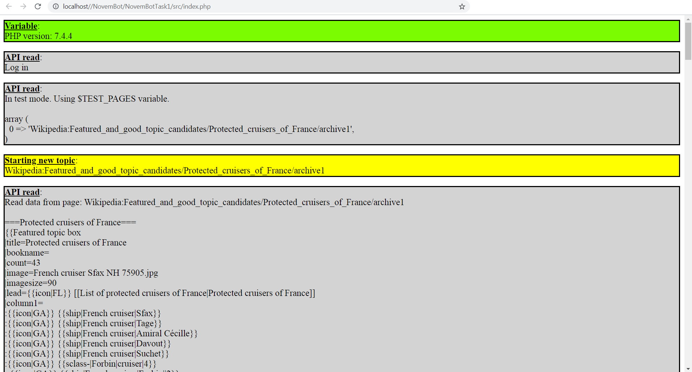

## Description

NovemBot Task 1 is a Wikipedia bot that automates the 10-step featured topic and good topic promotion process. The steps are located at https://en.wikipedia.org/wiki/User:Aza24/FTC/Promote_Instructions

## To install and run

### Windows

1) Install XAMPP, to run PHP: https://www.apachefriends.org/download.html

2) Download the repo.

3) To run the bot in read only mode, in your browser, visit https://localhost/NovemBotTask1/src/index.php. Adjust path depending on where XAMPP is pointed.

4) To run the bot in read-write mode, copy paste src/config-sample.php to src/config.php, then enter a Wikipedia account's username and password. Also set an http password. Then visit https://localhost/NovemBotTask1/src/index.php?password=yourHTTPPassword

#### Tests

5) Install Composer. https://getcomposer.org/download/

6) Open Powershell or command prompt. Navigate to the directory where the project is, using `cd`. Type the following to set up PHPUnit unit testing suite: `composer update`

7) To run the tests, in Powershell or command prompt, type `composer exec phpunit tests`

## Screenshots

